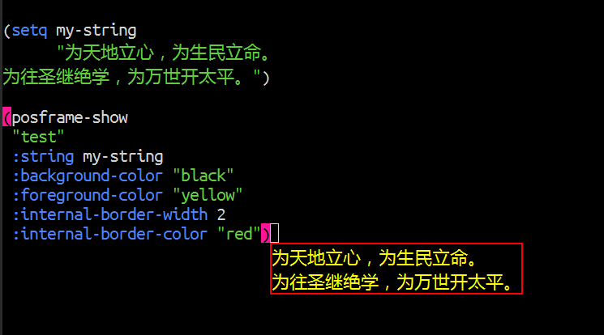

Note: this file is auto converted from posframe.el by [el2org](https://github.com/tumashu/el2org), please do not edit it by hand!!!

# &#30446;&#24405;

1.  [Posframe README](#org65b5096)
    1.  [What is posframe?](#orgd81e50a)
    2.  [Installation](#org25d0086)
    3.  [Usage](#orgc43df1d)
        1.  [Create a posframe](#org9920c17)
        2.  [Hide a posframe](#org8f7797e)
        3.  [Hide all posframes](#orgfd2c6ea)
        4.  [Delete a posframe](#orgd119456)
        5.  [Delete all posframes](#org0c7a761)
        6.  [Customizing mouse pointer control](#org9b3f377)
        7.  [Set fallback arguments of posframe-show](#orgc8e9887)

# Posframe README

## What is posframe?

Posframe can pop up a frame at point, this **posframe** is a
child-frame connected to its root window's buffer.

The main advantages are:

1.  It is fast enough for daily usage :-)
2.  It works well with CJK languages.

NOTE:

1.  For MacOS users, posframe needs Emacs version >= 26.0.91
2.  GNOME users with GTK3 builds need Emacs 27 or later.
    See variable \`posframe-gtk-resize-child-frames'
    which auto-detects this configuration.
    
    More details:
    
    1.  [Fix some problems with moving and resizing child frames](https://git.savannah.gnu.org/cgit/emacs.git/commit/?h=emacs-27&id=c49d379f17bcb0ce82604def2eaa04bda00bd5ec)
    2.  [Emacs's set-frame-size can not work well with gnome-shell?](https://lists.gnu.org/archive/html/emacs-devel/2020-01/msg00343.html)

## Installation

    (require 'posframe)

## Usage

### Create a posframe

1.  Simple way

        (when (posframe-workable-p)
          (posframe-show " *my-posframe-buffer*"
                         :string "This is a test"
                         :position (point)))

2.  Advanced way

        (defvar my-posframe-buffer " *my-posframe-buffer*")
        
        (with-current-buffer (get-buffer-create my-posframe-buffer)
          (erase-buffer)
          (insert "Hello world"))
        
        (when (posframe-workable-p)
          (posframe-show my-posframe-buffer
                         :position (point)))

3.  Arguments

        C-h f posframe-show

### Hide a posframe

    (posframe-hide " *my-posframe-buffer*")

### Hide all posframes

    M-x posframe-hide-all

### Delete a posframe

1.  Delete posframe and its buffer
    
        (posframe-delete " *my-posframe-buffer*")
2.  Only delete the frame
    
        (posframe-delete-frame " *my-posframe-buffer*")

### Delete all posframes

    M-x posframe-delete-all

Note: this command will delete all posframe buffers.
You probably shouldn't use it if you are sharing a buffer
between posframe and other packages.

### Customizing mouse pointer control

By default, posframe moves the pointer to point (0,0) in
the frame, as a way to address an issue with mouse focus.
To disable this feature, add this to your init.el:

    (setq posframe-mouse-banish nil)

### Set fallback arguments of posframe-show

Users can set fallback values of posframe-show's arguments with the
help of \`posframe-arghandler'.  The example below sets fallback
border-width to 10 and fallback background color to green.

    (setq posframe-arghandler #'my-posframe-arghandler)
    (defun my-posframe-arghandler (buffer-or-name arg-name value)
      (let ((info '(:internal-border-width 10 :background-color "green")))
        (or (plist-get info arg-name) value)))

